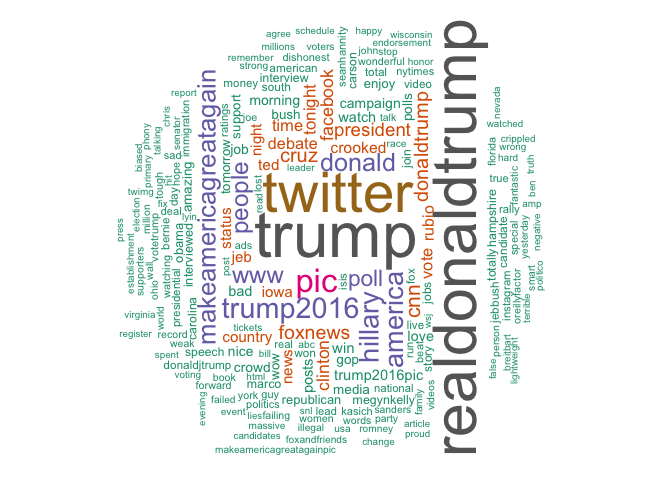
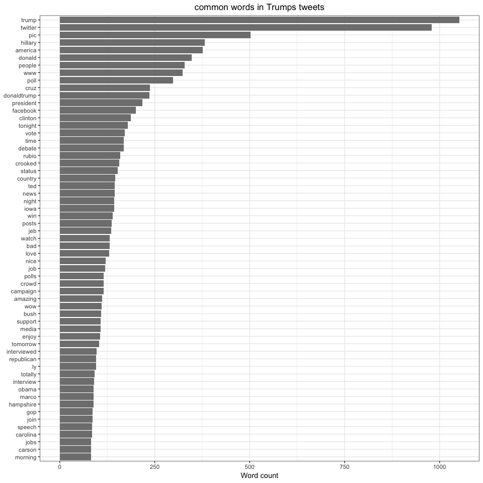

trump\_words.rmd
================
Rebecca Asiimwe
2018-11-27

Install required packages
-------------------------

``` r
#install.packages("tm")  # for text mining
#install.packages("SnowballC") # for text stemming
#install.packages("wordcloud") # word-cloud generator 
#install.packages("RColorBrewer") # color palettes
#install.packages("webshot")
#webshot::install_phantomjs()
```

Load packages
-------------

``` r
suppressPackageStartupMessages(library(ggplot2)) 
suppressPackageStartupMessages(library(tidyverse)) 
suppressPackageStartupMessages(library(purrr))
suppressPackageStartupMessages(library(RColorBrewer))
suppressPackageStartupMessages(library(tibble))
suppressPackageStartupMessages(library(repurrrsive))
suppressPackageStartupMessages(library(tidytext))
suppressPackageStartupMessages(library(dplyr))
suppressPackageStartupMessages(library(stringr))
suppressPackageStartupMessages(library(tm))
suppressPackageStartupMessages(library(SnowballC))
suppressPackageStartupMessages(library(wordcloud))
suppressPackageStartupMessages(library(RColorBrewer))
```

Finding the Commonest words in a dataset based on frequency of occurance
------------------------------------------------------------------------

``` r
#loading merged dataset
trump_tweets_df<-read.csv("files/dataset_merge.txt", sep=",")

#creating a neater dataset to work with
regex_words <- "([^A-Za-z_\\d#@']|'(?![A-Za-z_\\d#@]))" 
tweets2 <- trump_tweets_df %>%
    filter(!str_detect(Text, "^QRT")) %>%
    mutate(Text = str_replace_all(Text, "https://t.co/[A-Za-z\\d]+|http://[A-Za-z\\d]+|&amp;|&lt;|&gt;|RT|https", "")) %>%
    unnest_tokens(word, Text, token = "regex", pattern = regex_words) %>%
    filter(!word %in% stop_words$word,
                 str_detect(word, "[a-z]"))


words <- tweets2$word
words <- Corpus(VectorSource(words))
#inspect(words)


#Building document matrix- table containing the frequency of the words
data_matrix <- TermDocumentMatrix(words)
mtx <- as.matrix(data_matrix)
sort_mtx <- sort(rowSums(mtx),decreasing=TRUE)
word_freq <- data.frame(word = names(sort_mtx),freq=sort_mtx)


wordcloud(words = word_freq$word, freq = word_freq$freq, min.freq = 1,
                    max.words=200, random.order=FALSE, rot.per=0.35, 
                    colors=brewer.pal(8, "Dark2"))
```



Above is a word cloud that shows the most common words in the trump tweets data set. In previous work I look out for common words with certain pertterns. Here, I would like to **take any dataset and see which words appear commonest.**

### Representation 2

``` r
common_words <- tweets2 %>%
    count(word, sort=TRUE) %>%
    filter(substr(word, 1, 1) != '#', # omiting hashtags
                 substr(word, 1, 1) != '@', # omiting Twitter handles
                 n > 80) %>% # only most common words
    mutate(word = reorder(word, n))

names(common_words)[names(common_words)=='n'] <- 'word_frequency' ##renaming column n to word_frequency

write.table(common_words, "common_words.tsv",sep = "\t", row.names = FALSE, quote = FALSE) #writing out common_words to a tsv file

#bar plot of commonest words
common_words %>%  ggplot(aes(word, word_frequency)) +
    geom_bar(stat = 'identity', fill=c("gray50")) +
    xlab(NULL) +
    ylab(paste('Word count', sep = '')) +
    ggtitle(paste('common words in Trumps tweets')) +
    theme(legend.position="none") +
    coord_flip() +
    theme_bw() +
    theme(plot.title = element_text(hjust = 0.5))
```



We can also use a bar as the above to nicely represent the commonest words in a dataset.
